# 渗透过程记录

## 服务器 1

- **步骤 1：fscan 扫描发现 ThinkPHP 漏洞**  
    截图：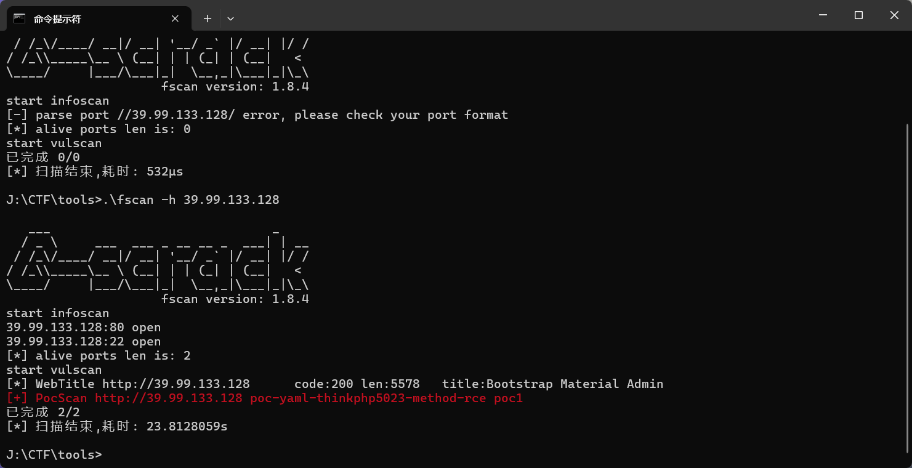

- **步骤 2：发现后门文件**  
    截图：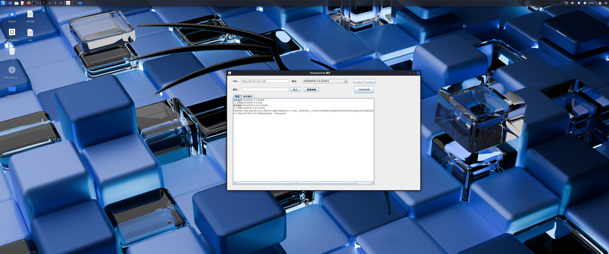

- **步骤 3：蚁剑连接后门（WebShell 建立）**  
    截图：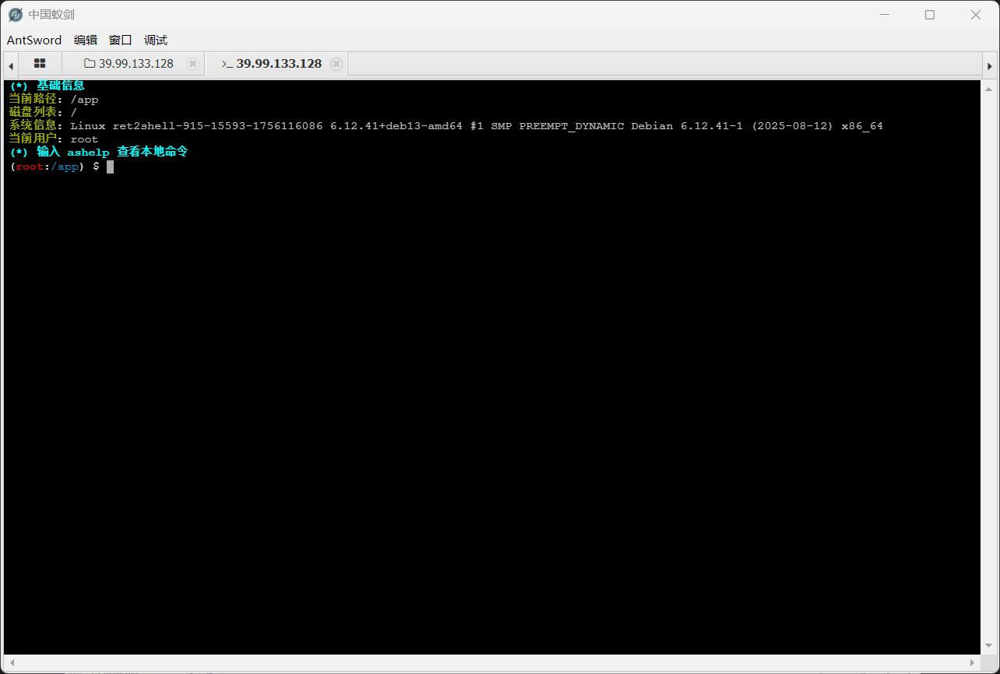

- **步骤 4：MySQL 相关操作 / 尝试提权**  
    截图：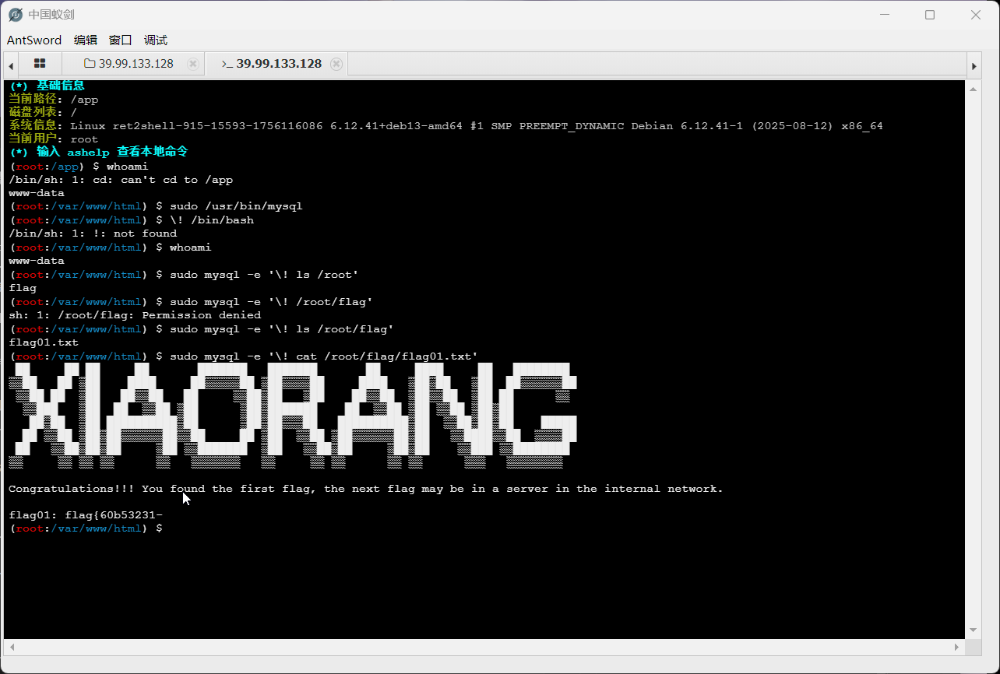

- **步骤 5：找到 flag**（原始记录未写明路径与内容）

---

## 服务器 2

- **步骤 1：在服务器 1 与 VPS 上配置 frp，建立 SOCKS5 代理**  
    截图：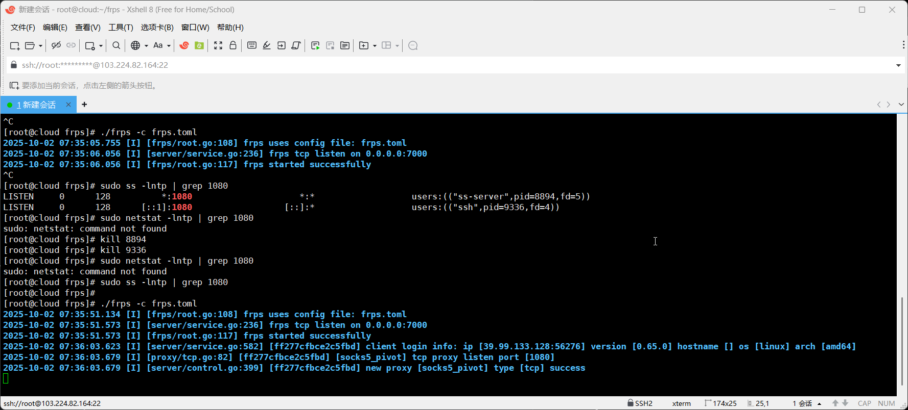

- **步骤 2：使用 fscan 扫描内网发现多台服务器**  
    截图：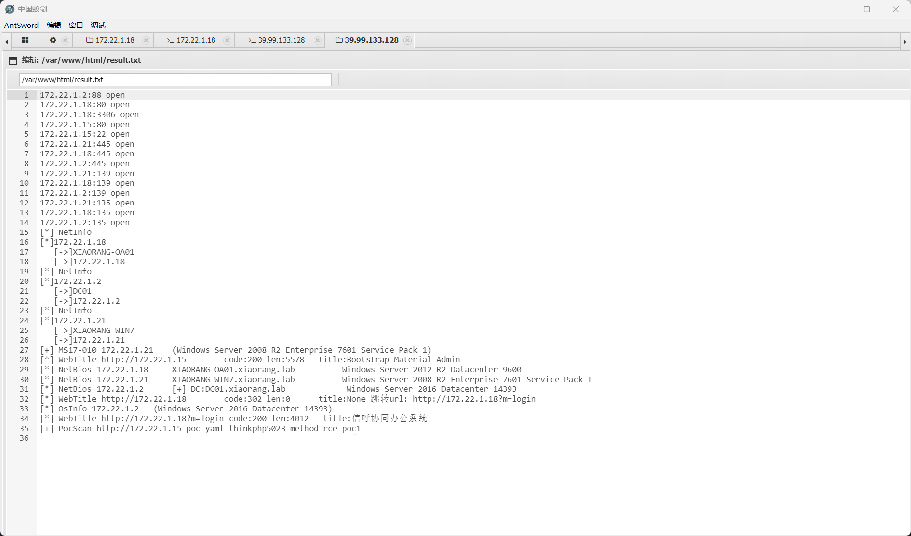

- **步骤 3：发现弱密码并登录信呼系统**  
    截图：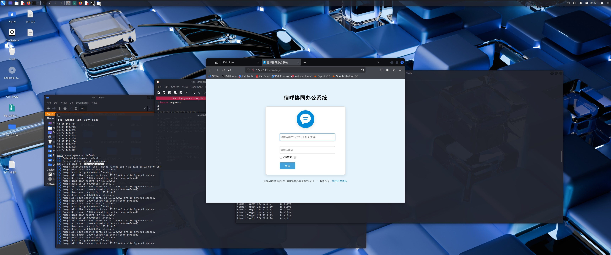

- **步骤 4：利用信呼文件上传漏洞，脚本上传后门并用蚁剑连接**  
    截图：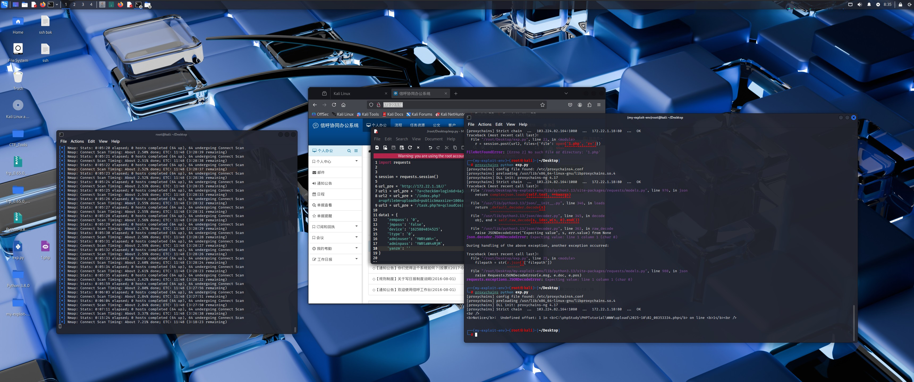

- **步骤 5：在文件中找到 flag**  
    截图：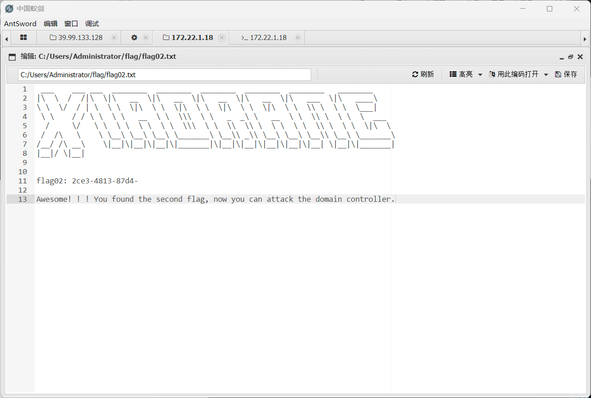

---

## 服务器 3

- **步骤 1：使用 msf 扫描发现 MS17-010 漏洞**  
    截图：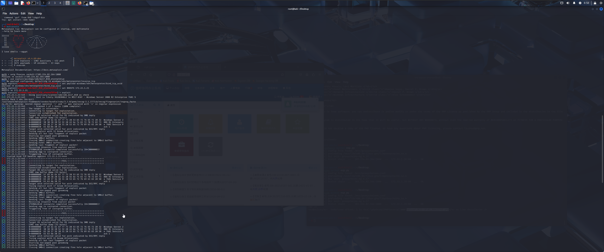

- **步骤 2：利用漏洞建立 Meterpreter 会话**  
    截图：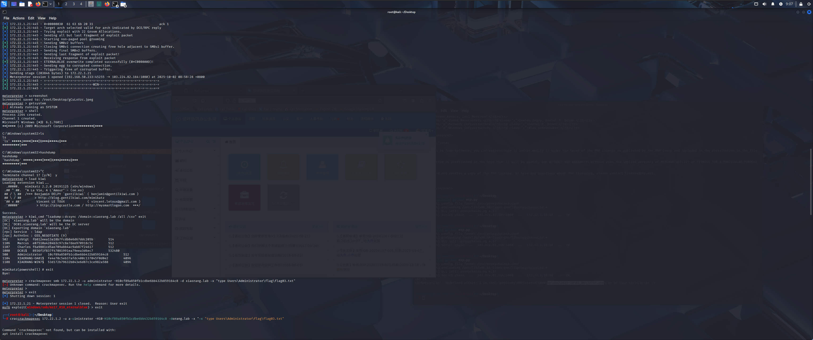

- **步骤 3：发现无法正常使用 cmd**  
    截图：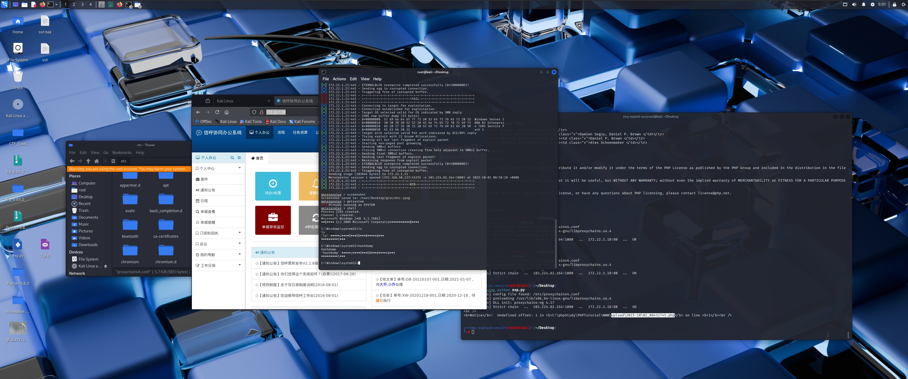

- **步骤 4：使用凭证提取工具（如 mimikatz）抓取 hash**  
    截图：

- **步骤 5：通过 crackmapexec 使用 hash 执行命令 / 登录**  
    截图：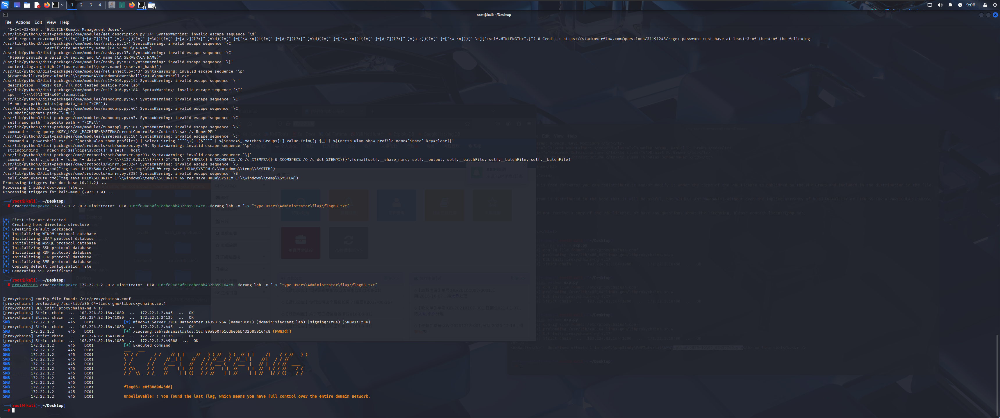

- **步骤 6：在文件中找到 flag**（原始记录未写明路径与内容）

---

使用到的技术/工具：
- fscan
- ThinkPHP
- AntSword
- frp / SOCKS5
- Xshell
- Metasploit / Meterpreter
- mimikatz
- crackmapexec
